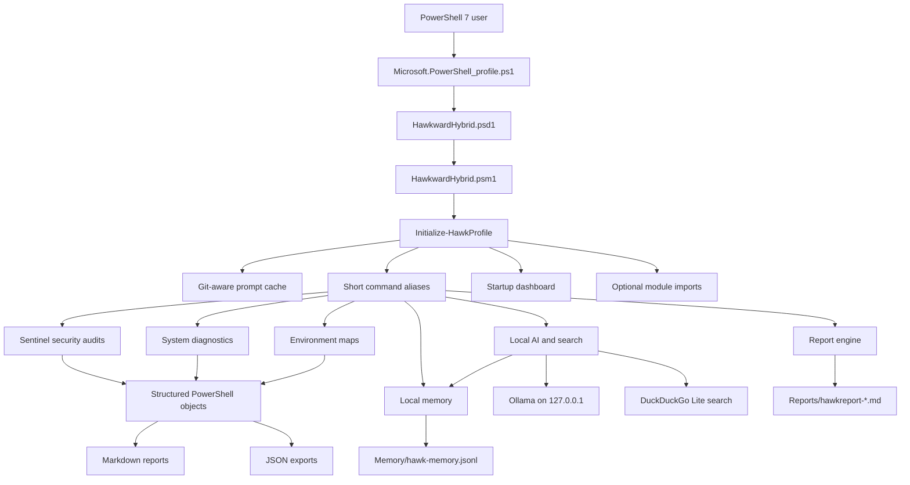
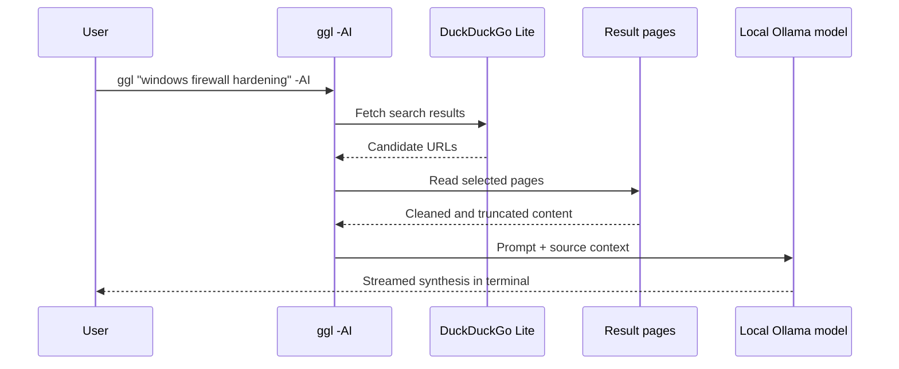

# 🦅 Hawkward Hybrid

**Hawkward Hybrid turns your PowerShell 7 terminal into a fully-loaded ops toolkit** focused on auditing Windows security and monitoring system health. Integrated with a private local AI right in the terminal, tuned to the PowerShell 7 environment and also able to synthesise answers straight from the web using duckduckgo search. A live dashboard with tooltips and guides walks you through capabilities that security teams pay thousands for. All built into your profile — custom, free, offline, and completely private.

> **A battle-hardened PowerShell 7 profile — Sentinel Edition**  
> Security auditing · System diagnostics · Local AI integration · Developer workspace tooling

[](https://github.com/PowerShell/PowerShell)
[](https://www.microsoft.com)
[-8A2BE2?logo=ollama)](https://ollama.com)
[](LICENSE)
[](#)

---

## 🧭 Profile-Level Signal

This repository is not just a PowerShell profile. It is a case study in building a local-first operations system: security checks, diagnostics, AI-assisted analysis, memory, reporting, and a dashboard wrapped into one daily terminal workflow.

| What I Build | How I Think | Problems I Care About |
|---|---|---|
| Local developer and sysadmin tools that reduce friction in the terminal | Systems first: start with the workflow, then module boundaries, then aliases, then proof | Security visibility, local AI privacy, repeatable diagnostics, and faster operator feedback loops |
| PowerShell 7 modules with clean profile loading and memorable commands | AI as an engineering partner: prompts, constraints, failures, refinements, and verification are part of the artefact | Turning scattered checks into calm, inspectable workflows |
| Tooling that produces evidence: reports, maps, audits, and build logs | Iterative delivery: ship useful slices, measure pain, harden the weak points | Making thoughtful engineering visible to humans scanning a repo in 30 seconds |

Most project READMEs stop at “here is the app.” This one also shows why the system exists, how it is assembled, where AI helped, and what trade-offs shaped the result.

---

## 🎯 Why This Exists

PowerShell profiles usually grow into personal junk drawers: aliases, one-off scripts, brittle startup logic, and tools that only make sense to the original author. Hawkward Hybrid turns that pattern into a structured local ops layer.

The goal is simple:

- Make security and system state visible from the first terminal session
- Keep AI analysis private by default through local Ollama inference
- Replace scattered manual checks with repeatable commands and saved reports
- Preserve the reasoning behind the build so the repo shows process, not just output

The project is aimed at developers, sysadmins, and AI-assisted builders who want a terminal that can inspect, explain, report, and remember without shipping sensitive context to a cloud service.

---

## 🧩 Architecture



### Data Flow: Web-to-AI Search



---

## 🔁 Before / After

| Before | After |
|---|---|
| A plain PowerShell profile with scattered functions | A module-backed toolkit loaded by a thin profile bootstrap |
| Manual security checks across ports, firewall, registry, events, and tasks | One-command audits: `ghostaudit`, `fwaudit`, `bootmap`, `taskaudit`, `evntaudit` |
| AI use was separate from the terminal workflow | Pipeline-native local AI: `resmap \| ai "what matters here?"` |
| Sensitive context required manual caution | `secretredact` and local Ollama keep private data handling explicit |
| Diagnostics disappeared after the session | `hawkreport` creates timestamped Markdown or JSON evidence |
| Reasoning lived outside the repo | `PROJECT_LOG.md` records prompts, failures, refinements, and design lessons |

---

## 🤖 AI Workflow & Iteration Strategy

The AI layer is designed as a workflow primitive, not a novelty feature.

| Workflow Move | How It Shows Up Here |
|---|---|
| Prompt strategy | The local model receives a context envelope: intent, mode, data profile, relevant local memory, and pipeline input |
| Constraint setting | The assistant contract asks for concise answers, data-first reasoning, and no commands unless requested |
| Failure refinement | Streaming replaced buffered REST calls; module loading replaced a brittle monolithic profile; redaction guards were added before AI handoff |
| Verification | `hawkdoctor`, structured report generation, parser checks, and command aliases make the workflow inspectable |
| Memory | `remember`, `recall`, and `memmap` store local preferences and runbooks as gitignored JSONL |

### Build Log Snapshot

| Iteration | Problem Found | Refinement |
|---|---|---|
| 1. Profile prototype | One syntax error could break the whole shell | Move logic into `HawkwardHybrid.psm1`; keep the profile as a loader |
| 2. Audit suite | Listing data was useful but noisy | Cross-reference listeners, firewall rules, startup entries, scheduled tasks, and events |
| 3. AI integration | Buffered AI responses felt slow and opaque | Stream Ollama responses token-by-token with retry support |
| 4. Privacy pass | Pipeline data can include secrets | Add `secretredact`, sensitive env detection, and local-only model defaults |
| 5. Proof layer | Good diagnostics vanished after the terminal closed | Generate Markdown/JSON reports and document the build decisions in `PROJECT_LOG.md` |

---

## 🖼️ Demo & Screenshots

The current repo is ready for visual proof. Add these assets before publishing the profile widely:

| Asset | Placeholder | Purpose |
|---|---|---|
| Dashboard screenshot | `{PLACEHOLDER: docs/screenshots/dashboard.png}` | Show the first-session experience |
| Security audit screenshot | `{PLACEHOLDER: docs/screenshots/fwaudit-nettriage.png}` | Prove the audit suite is real |
| AI analysis screenshot | `{PLACEHOLDER: docs/screenshots/local-ai-pipeline.png}` | Show pipeline data flowing into local AI |
| Report output screenshot | `{PLACEHOLDER: docs/screenshots/hawkreport-markdown.png}` | Show generated evidence |
| Short demo GIF | `{PLACEHOLDER: docs/demo/hawkward-hybrid-terminal-demo.gif}` | Recruiter-friendly 20-30 second scan |

---

## ✅ Repo-Level Audit Snapshot

| Area | Signal In This Repo |
|---|---|
| Clarity | Problem, audience, workflow, and command surface are stated up front |
| Architecture | Module loader, manifest, module boundaries, report engine, AI path, and memory store are diagrammed |
| AI Usage | Prompt strategy, context envelope, local inference, search synthesis, and failure refinements are documented |
| Proof | Dashboard preview exists; screenshot and GIF placeholders are now called out explicitly |
| Engineering Signals | Module manifest, structured outputs, git prompt cache, report generation, `.gitignore` privacy boundaries, and build log |

---

## ✨ What Is This?

Hawkward Hybrid is a **custom PowerShell 7 module and profile** that transforms a plain terminal into a self-contained ops toolkit. It ships with:

- A **full-screen dashboard** that renders on every session startup
- A **multi-layer security audit suite** covering ports, firewall, startup persistence, scheduled tasks, and suspicious processes  
- **Real-time system diagnostics** for disk, CPU/RAM, event logs, and network listeners  
- A **local AI pipeline** powered by Ollama — analyze data, answer questions, and run web-to-AI searches without sending data to the cloud
- A **customised prompt** showing OS, PS version, user, path, and live Git branch status  
- A **Markdown report generator** that snapshots the entire system state to a timestamped file

Everything is accessed through short, memorable **aliases** — no typing long cmdlet names.

---

## 🖥️ Dashboard Preview

```
  ╭──────────────────────────────────────────────────────────────────────────╮
  │ 🦅 HAWKWARD HYBRID 11.2 · SENTINEL EDITION                               │
  ├──────────────────────────────────────────────────────────────────────────┤
  │ AI Engine : ACTIVE    Workspace : E:\Projects                            │
  ╰──────────────────────────────────────────────────────────────────────────╯

  🛡️ SENTINEL              🩺 DIAGNOSTICS           ⚙️ ENVIRONMENT          🤖 AI & WORKSPACE
  Security & Audits        System & Health          State & Config          Core Tools
  ─────────────────────    ─────────────────────    ──────────────────────  ──────────────────────
  ◌ ghostaudit  Ports       ✚ hawkdoctor  Health    □ fwmap      Rules      ⌕ ggl        Search+AI
  ▲ susaudit    AppData     ◉ aidoctor    Ollama    ≡ envmap     Env vars   λ ai         Analyze
  ▣ fwaudit     Firewall    ◷ evntmap     Events    ⌘ pathaudit  PATH       ⑂ projaudit  Repos
  ⌁ taskaudit   Tasks       ↯ evntaudit   Storms    ◦ portmap    Listeners  ▧ hawkreport Report
  ◆ secretredact Secrets    ▰ diskaudit   Disk      ⇄ nettriage  Network    ↗ proj       Root
                             ▤ resmap      CPU/RAM   ⌂ bootmap    Startup    ▦ dash       Dashboard
                                                                             ↻ reload     Profile
                                                                             ? hawkman    Guide
```

---

## 🚀 Quick Start

### Prerequisites

| Requirement | Version | Install |
|---|---|---|
| PowerShell | 7.0+ | [Download](https://github.com/PowerShell/PowerShell/releases) |
| Git | Any | [Download](https://git-scm.com) |
| Ollama | Latest | [Download](https://ollama.com) *(optional — for AI features)* |
| Nerd Font | Any | [Nerd Fonts](https://www.nerdfonts.com) *(for icons)* |

### 1 — Clone the repository

```powershell
git clone https://github.com/YOUR_USERNAME/hawkward-hybrid.git "$HOME\Documents\PowerShell"
```

> **Note:** If your `$HOME\Documents\PowerShell` folder already exists, clone to a temp location and copy the contents across manually.

### 2 — Install module dependencies

Open PowerShell 7 and run:

```powershell
Import-Module "$HOME\Documents\PowerShell\Modules\HawkwardHybrid\HawkwardHybrid.psd1" -Force
Install-HawkPrerequisites
```

This installs: `Terminal-Icons`, `PSReadLine`, `PSTree`.

### 3 — Wire up the profile

The profile bootstrap is already at `Microsoft.PowerShell_profile.ps1`. Verify the path PowerShell expects:

```powershell
$PROFILE.CurrentUserCurrentHost
```

If it points somewhere else, symlink or copy the file:

```powershell
Copy-Item ".\Microsoft.PowerShell_profile.ps1" $PROFILE.CurrentUserCurrentHost -Force
```

### 4 — (Optional) Set up local AI with Ollama

```powershell
# Install and run Ollama, then create the custom hawk-reasoning model:
ollama create hawk-reasoning -f .\AI\distilledqwen.modelfile

# Verify it's working:
aidoctor
```

### 5 — Reload your profile

```powershell
reload
```

The dashboard will appear on every new session automatically.

---

## 📋 Command Reference

### 🛡️ Sentinel — Security Audits

| Alias | Full Function | What It Does |
|---|---|---|
| `ghostaudit` | `Get-HawkGhostPortAudit` | Detects orphaned TCP listeners with no owning process |
| `susaudit` | `Get-HawkSuspiciousProcessAudit` | Flags processes running from `AppData` or `Temp` |
| `fwaudit` | `Get-HawkFirewallAudit` | Cross-references open ports against inbound firewall allow rules |
| `taskaudit` | `Get-HawkScheduledTaskRiskAudit` | Finds scheduled tasks invoking `powershell`, `cmd`, or temp paths |
| `bootmap` | `Get-HawkBootMap` | Scrapes `HKLM` and `HKCU` Run registry keys for startup persistence |
| `secretredact` | `Protect-HawkSensitiveText` | Redacts secrets, tokens, passwords, and keys from pipeline output |

### 🩺 Diagnostics — System Health

| Alias | Full Function | What It Does |
|---|---|---|
| `hawkdoctor` | `Get-HawkDoctor` | Profile parser check, module availability, project root, Ollama status |
| `aidoctor` | `Get-HawkAIStatus` | Lists Ollama models with size and last modified date |
| `evntmap` | `Get-HawkEventMap` | Last 20 System/Application warning and error events |
| `evntaudit` | `Get-HawkEventStormAudit` | Detects event storms (>5 occurrences in a 30-minute window) |
| `diskaudit` | `Get-HawkDiskPressureAudit` | Disk usage by drive with free space percentage |
| `resmap` | `Get-HawkResourceMap` | Top 10 processes by RAM/CPU consumption |

### ⚙️ Environment — State & Config

| Alias | Full Function | What It Does |
|---|---|---|
| `fwmap` | `Get-HawkFirewallMap` | Lists top 15 enabled inbound allow firewall rules |
| `envmap` | `Get-HawkEnvMap` | Environment variable audit — auto-redacts sensitive names |
| `pathaudit` | `Get-HawkPathAudit` | Validates every `$env:Path` entry (missing, duplicate, empty) |
| `portmap` | `Get-HawkPortMap` | All TCP listeners with owning process and company name |
| `nettriage` | `Get-HawkNetworkTriage` | Port + PID + process + matched firewall rule in one view |

### 🤖 AI & Workspace

| Alias | Full Function | What It Does |
|---|---|---|
| `ai` | `Invoke-HawkAI` | Pipe any data to the local Ollama model for analysis |
| `ggl` | `Invoke-HawkSearch` | Search any engine in-browser, or add `-AI` for web-to-AI synthesis |
| `remember` | `Add-HawkMemory` | Save local preferences, runbooks, and useful notes |
| `recall` | `Search-HawkMemory` | Search local memory |
| `memmap` | `Get-HawkMemoryMap` | List recent or pinned memory entries |
| `projaudit` | `Get-HawkProjectAudit` | Lists all Git repos under the project root with branch/dirty status |
| `proj` | `Invoke-HawkProject` | `cd` to the configured project root |
| `hawkreport` | `New-HawkReport` | Full system snapshot → console table + timestamped Markdown file |
| `dash` | `Show-HawkDashboard` | Re-render the startup dashboard |
| `reload` | `Update-HawkProfile` | Dot-source the profile without restarting the terminal |
| `hawkman` | `Show-HawkManual` | Print the quick reference workflow guide |

---

## 🤖 AI Features In Depth

### Pipe anything to the local model

```powershell
# Analyze system resources
resmap | ai 'Which processes are consuming the most memory and why?'

# Redact secrets before sending to AI
envmap -IncludeSensitive | secretredact | ai 'Summarize the environment configuration.'

# Direct question
"Explain PSReadLine prediction modes" | ai

# Save a high-value preference for future AI calls
remember "Prefer fast answers unless I ask for deep analysis." -Type preference -Pinned

# Save a useful AI answer as session memory
resmap | ai "What is using the most memory?" -Remember
```

### Web-to-AI search synthesis

```powershell
# Opens a browser
ggl "powershell scheduled tasks best practices"

# Fetches top DuckDuckGo results, scrapes content, synthesizes with AI
ggl "powershell scheduled tasks best practices" -AI

# Default AI search is fast; use Deep when more sources matter
ggl "powershell scheduled tasks best practices" -AI -Deep

# Use a specific engine for browser search
ggl "windows firewall hardening" -Engine bing
```

### Custom AI model

The `AI/` directory contains Ollama `Modelfile`s for the `hawk-reasoning` model. The model is configured to:

- Default to PowerShell 7 syntax
- Skip chain-of-thought reasoning output
- Be concise, practical, and efficient
- Respect the user's project root (`E:\Projects`)

---

## 📄 Report Generation

```powershell
# Console output + save Markdown to Reports/
hawkreport

# Export as Markdown only
hawkreport -Format Markdown -Path .\my-report.md

# Export as JSON
hawkreport -Format Json -Path .\my-report.json
```

Reports are saved to the `Reports/` directory as `hawkreport-YYYYMMDD-HHmmss.md`.

---

## 🗂️ Repository Structure

```
PowerShell/
├── Microsoft.PowerShell_profile.ps1   ← Profile bootstrap (loader)
│
├── Modules/
│   └── HawkwardHybrid/
│       ├── HawkwardHybrid.psm1        ← Main module (~1550 lines)
│       └── HawkwardHybrid.psd1        ← Module manifest (v11.2)
│
├── AI/
│   ├── distilledqwen.modelfile        ← hawk-reasoning (Qwen3-4B distill)
│   ├── gemma.modelfile                ← Gemma variant
│   └── qwen.modelfile                 ← Qwen base variant
│
├── Reports/                           ← Auto-generated system snapshots (gitignored)
│
└── Scripts/
    └── InstalledScriptInfos/          ← PSResourceGet metadata (gitignored)
```

---

## ⚙️ Configuration

| Variable | Default | Description |
|---|---|---|
| `$HawkDefaultProjectRoot` | `E:\Projects` | Default `proj` jump target |
| `$HawkRequiredModules` | `Terminal-Icons, PSReadLine, PSTree` | Auto-imported on load |
| `$HawkReportRoot` | `<ProfileRoot>\Reports` | Where report files are saved |
| `$env:HAWK_NO_DASH` | *(unset)* | Set to any value to suppress the dashboard |
| `$env:CI` | *(unset)* | Automatically suppresses dashboard in CI environments |

To use a different project root:

```powershell
Initialize-HawkProfile -ProjectRoot 'D:\Work' -ShowDashboard
```

---

## 🔒 Security Notes

- **`secretredact`** / `Protect-HawkSensitiveText` automatically masks values for keys matching: `secret`, `token`, `password`, `passwd`, `pwd`, `credential`, `connectionstring`, `sas`, `bearer`, `apikey`, `privatekey`
- All AI inference runs **100% locally** via Ollama — no data leaves your machine
- Local memory is stored under `Memory/` as JSONL and ignored by git
- The profile detects non-admin sessions and warns when registry access may be limited
- The dashboard and interactive features are **suppressed in CI** (`$env:CI`) and redirected-output sessions automatically

---

## 🧩 Dependencies

These modules are managed by `Install-HawkPrerequisites`:

| Module | Purpose |
|---|---|
| [`Terminal-Icons`](https://github.com/devblackops/Terminal-Icons) | File/folder icons in directory listings |
| [`PSReadLine`](https://github.com/PowerShell/PSReadLine) | IntelliSense history prediction with `ListView` mode |
| [`PSTree`](https://github.com/santisq/PSTree) | Tree-view directory display |

---

## 🤝 Contributing

1. Fork the repository
2. Create a feature branch: `git checkout -b feature/my-new-audit`
3. Keep functions in the `Verb-HawkNoun` naming pattern
4. Add an alias in `Set-HawkAliases` and a dashboard entry in `Show-HawkDashboard`
5. Test with `hawkdoctor` before submitting a PR

---

## 📜 License

MIT © 2026 shahr / Hawkward

---

<div align="center">
  <sub>Built in PowerShell 7 · Runs entirely on your machine · No telemetry · No cloud dependencies</sub>
</div>
