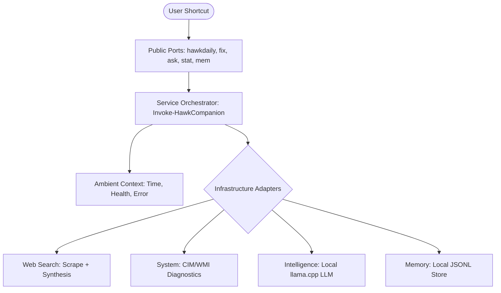

<div align="center">


# PowershellOps

**Advanced Operational Intelligence & Universal AI Companion for Windows.**  
*Private. High-Performance. Local Agentic Stack.*

[](#)
[-8A2BE2?logo=llama&logoColor=white)](#)
[](#)
[](#)

---

**126 Functions · 90 Aliases · 7 Operational Workflows · Universal AI Hub · Zero Cloud Dependencies**  
*Muted, professional precision for the modern Technical Specialist.*

[Features](#-key-capabilities-) • [Installation](#-provisioning-) • [The Hub](#-the-companion-hub-hub-) • [Memory](#-semantic-recall-memory-) • [Security](#-security-audit) • [Walkthrough](docs/AGENTIC-IDE-TUTORIAL.md)

</div>

---

## ── PHILOSOPHY ────────────────────────────────────────────────────────────

PowershellOps is a professional **Agentic Stack** for Windows, designed for specialists who demand privacy, execution speed, and deep system insights. It transforms the terminal from a command shell into an **Intelligent Companion Hub** that reasons over local context and researches online information entirely within your perimeter.

- 🤖 **AGENTIC WORKFLOWS**: Multi-step AI reasoning for system repair and data analysis.
- 🎯 **SITUATIONAL AWARENESS**: Automatic injection of time, date, and system load into every AI query.
- 🛡️ **SECURITY SUBSTRATE**: Local auditing of firewalls, listeners, and persistence vectors.
- 📦 **PORTABLE & CLEAN**: A minimalist "Thin Core" architecture with zero meta-bloat.

---

## ── PROVISIONING ────────────────────────────────────────────────────────────

Deploy the core operational environment directly from **PowerShell 7**:

```powershell
irm https://raw.githubusercontent.com/shahriarhaqueabir/PowershellOps/main/hawk-installer/install.ps1 | iex
```

*Requirements: PowerShell 7.2+, Git, and llama.cpp (optional for AI features). Piped (`irm | iex`) invocations auto-download the installer bundle to `%TEMP%` and relaunch from disk.*

---

## ── MANUAL INSTALLATION ────────────────────────────────────────────────────

Prefer to wire it by hand instead of running `install.ps1`? From **PowerShell 7**:

```powershell
# 0. Source checkout
git clone https://github.com/shahriarhaqueabir/PowershellOps.git
cd PowershellOps\hawk-installer

# 1. Resolve the PS7 home (same paths the installer uses)
$psHome = Join-Path ([Environment]::GetFolderPath('MyDocuments')) 'PowerShell'

# 2. Module → user module path
New-Item -ItemType Directory -Force "$psHome\Modules\HawkwardHybrid" | Out-Null
Copy-Item .\modules\HawkwardHybrid\* "$psHome\Modules\HawkwardHybrid\" -Force

# 3. Profile template → $PROFILE  (replaces your profile — back it up first)
if (Test-Path $PROFILE) { Copy-Item $PROFILE "$PROFILE.bak-$(Get-Date -Format yyyyMMdd-HHmmss)" }
Copy-Item .\profile\Microsoft.PowerShell_profile.ps1 $PROFILE -Force

# 4. User-scope dependencies
Install-Module Terminal-Icons, PSTree -Scope CurrentUser

# 5. Optional AI engine (llama.cpp + local GGUF), guided:
pwsh -NoProfile    # restart into the wired profile, then:
onboard -Apply
```

**Notes**

- Step 3 mirrors the installer's wiring step: it **replaces** `$PROFILE`. Merge your customizations back in from the `.bak-*` backup.
- Config (`projectRoot`, memory root, llama endpoint/model) persists to `~\Documents\PowerShell\hawk.config.json` and `hawk-settings.json` — created automatically on first run / onboarding.
- All targets are user-scoped; no admin rights required.

---

## ── THE COMPANION HUB (`hub`) ──────────────────────────────────────────────


The central "Brain" of your terminal. A single entry point for high-speed operational tasks.

| Shortcut | Command | Action |
|:---|:---|:---|
| **`fix`**   | `Invoke-HawkShortFix` | **Self-Healing**: AI-driven remediation of the last error. |
| **`stat`**  | `Invoke-HawkShortStat` | **Instant Pulse**: 1-page health/resource snapshot. |
| **`ask`**   | `Invoke-HawkShortAsk` | **Pipable Research**: Analyze pipeline data with local LLMs. |
| **`mem`**   | `Invoke-HawkShortMem` | **Semantic Recall**: Save personal operational notes/preferences. |

---

## ── KEY CAPABILITIES ───────────────────────────────────────────────────────

| Domain | Tools | Description |
|:---|:---|:---|
| 🤖 **AI & Workspace** | 13 | Local LLM chat, web search synthesis, model management, project navigation |
| 🛡️ **Security Audit** | 11 | Firewall gaps, ghost ports, persistence sweeps, Defender health, registry/IFEO scans |
| 🩺 **Diagnostics** | 5 | One-shot health views, stack health checks, integration tests, event mapping |
| 🌍 **Environment** | 6 | Firewall maps, env vars, PATH audit, port maps, network triage, boot maps |
| 🦙 **Llama Server** | 4 | Start/stop/status/doctor for local llama.cpp server |
| 🖥️ **System Matrix** | 10 | CPU, RAM, battery, thermals, fans, displays, hypervisor, power, licensing |
| 🌐 **Network Intel** | 6 | Wi-Fi, DNS bench, link speed, SMB shares, hosts file, DNS cache |
| 🔍 **Security Scan** | 6 | Defender shield, admins, apps, patches, drivers, certificates |
| 💾 **Storage Forensics** | 9 | SMART health, crash dumps, zero-byte files, symlinks, locked/sparse/compressed files |
| 🧰 **Utilities** | 3 | App location, Explorer here, legacy matrix dashboard |

---

## ── ARCHITECTURE ────────────────────────────────────────────────────────────

PowershellOps utilizes a **Hexagonal (Ports & Adapters)** design to ensure maximum portability and low-latency execution.


```mermaid
graph TD
    User([User Shortcut]) --> Ports[Public Ports: hawkdaily, fix, ask, stat, mem]
    Ports --> Service[Service Orchestrator: Invoke-HawkCompanion]
    Service --> Context[Ambient Context: Time, Health, Error]
    Service --> Adapters{Infrastructure Adapters}
    Adapters --> Web[Web Search: Scrape + Synthesis]
    Adapters --> CIM[System: CIM/WMI Diagnostics]
    Adapters --> AI[Intelligence: Local llama.cpp LLM]
    Adapters --> Memory[Memory: Local JSONL Store]
```

---

## ── DATA INTEGRITY ────────────────────────────────────────────────────────

- 🔒 **100% Private**: No data ever leaves your machine. No telemetry, no cloud logging.
- 🧠 **Local Reasoning**: LLM operations are performed via local llama.cpp instances.
- 🔐 **Privacy Filters**: Integrated `secretredact` technology automatically redacts sensitive tokens before processing.

---

## ── QUICK REFERENCE ────────────────────────────────────────────────────────

### 🖥️ SYSTEM DIAGNOSTICS (`stat`)

| Alias | Canonical | Description | Technical Metric |
|:---|:---|:---|:---|
| `sysview` | `Get-HawkSysView` | Real-time system health | CPU, RAM, Procs, Handles, Services, AI |

### 🛡️ SECURITY AUDIT (`threathunt`)

| Alias | Canonical | Description | Audit Focus |
|:---|:---|:---|:---|
| `threathunt` | `Invoke-HawkThreatHunt` | Heuristic anomaly triage | Suspicious files, ports, processes |

### 🌐 NETWORK TRIAGE

| Alias | Canonical | Description | Connectivity Info |
|:---|:---|:---|:---|
| `nettriage` | `Get-HawkNetworkTriage` | Listener/process/firewall cross-reference | Optional WAN ping + interface summary |

---

## ── DISPATCH VERBS ────────────────────────────────────────────────────────


Four "umbrella" commands organize the most common queries under a single verb:

| Verb | Alias | Types |
|:---|:---|:---|
| `Get-HawkSystem` | `sysdiag` | `health`, `spec`, `uptime`, `ram`, `battery`, `display`, `disk`, `res`, `port`, `temp`, `fans`, `hyperv`, `power`, `license` |
| `Get-HawkAudit` | `auditdiag` | `fw`, `boot`, `schedtask`, `ghost`, `sus`, `storm`, `admin`, `shield`, `temp`, `clip`, `defender`, `reg`, `ifeo`, `pathaudit` |
| `Get-HawkNetwork` | `netview` | `ping`, `wifi`, `dns`, `linkspeed`, `shares`, `hosts`, `dnscache`, `established`, `nettriage`, `portmap` |
| `Get-HawkEnv` | `envdiag` | `envmap`, `path`, `app` |

```powershell
sysdiag -Type disk      # → Get-HawkDiskPressureAudit
auditdiag -Type fw      # → Get-HawkFirewallAudit
netview -Type ping      # → Get-HawkNetCheck
envdiag -Type path      # → Get-HawkPathAudit
```

---

## ── SENSORS & CMDLETS MAP ─────────────────────────────────────────────────

What each alias touches under the hood — CIM/WMI classes, cmdlets, files, and endpoints. Workflows (`hawkdaily`, `secaudit`, …) and dispatch verbs (`sysdiag`, …) are pure aggregators that fan out to these primitives.

### 🤖 AI & Workspace
| Alias | Canonical | Sensor / Cmdlet |
|:---|:---|:---|
| `ai` | `Invoke-HawkAI` | HTTP POST → llama.cpp `/v1/chat/completions` |
| `ggl` | `Invoke-HawkSearch` | `Invoke-WebRequest` (DuckDuckGo Lite / Google News RSS) |
| `hawkmodel` | `Get-HawkModel` | Filesystem scan `%USERPROFILE%\Models\GGUF\*.gguf` |
| `projaudit` | `Get-HawkProjectAudit` | Git CLI walk of `projectRoot` |

### 🛡️ Security Audit
| Alias | Canonical | Sensor / Cmdlet |
|:---|:---|:---|
| `ghostaudit` | `Get-HawkGhostPortAudit` | `Get-NetTCPConnection` (Listen) × process table |
| `fwaudit` | `Get-HawkFirewallAudit` | `Get-NetTCPConnection` + `Get-NetFirewallRule` + `Get-NetFirewallPortFilter` |
| `susaudit` | `Get-HawkSuspiciousProcessAudit` | `Get-Process` (Path filter: AppData/Temp) |
| `diskaudit` | `Get-HawkDiskPressureAudit` | CIM `Win32_LogicalDisk` (DriveType=3) |
| `taskaudit` | `Get-HawkScheduledTaskRiskAudit` | `Get-ScheduledTask` |
| `evntaudit` | `Get-HawkEventStormAudit` | `Get-WinEvent` (System/Application, Level 2–3) |
| `defendermap` | `Get-HawkDefenderAudit` | `Get-MpComputerStatus` / `Get-MpPreference` / `Get-MpThreatDetection` |
| `regaudit` | `Get-HawkRegAudit` | HKLM/HKCU Run keys + `Get-AuthenticodeSignature` |
| `ifeoaudit` | `Get-HawkIfeoAudit` | IFEO registry `Debugger` values |
| `regsnap` | `Save-HawkRegistrySnapshot` | `reg.exe export` |
| `secretredact` | `Protect-HawkSensitiveText` | Regex scrubbing (no system access) |

### 🩺 Diagnostics
| Alias | Canonical | Sensor / Cmdlet |
|:---|:---|:---|
| `sysview` | `Get-HawkSysView` | CIM `Win32_OperatingSystem`, `Win32_LogicalDisk`, services, ICMP ping, Defender state |
| `hawkdoctor` | `Get-HawkDoctor` | Profile parse + module availability checks |
| `hawkcheck` | `Test-HawkSetup` | Integration tests incl. AI known-answer round-trip |
| `evntmap` | `Get-HawkEventMap` | `Get-WinEvent` |
| `resmap` | `Get-HawkResourceMap` | `Get-Process` (WorkingSet/CPU) |

### 🌍 Environment
| Alias | Canonical | Sensor / Cmdlet |
|:---|:---|:---|
| `fwmap` | `Get-HawkFirewallMap` | `Get-NetFirewallRule` |
| `envmap` | `Get-HawkEnvMap` | Env scopes Process/Machine/User (REG_EXPAND_SZ expanded) |
| `pathaudit` | `Get-HawkPathAudit` | PATH segment validation + persisted registry PATH |
| `portmap` | `Get-HawkPortMap` | `Get-NetTCPConnection` + owning-process enrichment |
| `nettriage` | `Get-HawkNetworkTriage` | Listeners + owning proc + firewall rule (+ ICMP 1.1.1.1) |
| `bootmap` | `Get-HawkBootMap` | HKLM/HKCU Run-key startup entries |

### 🦙 Llama Server
| Alias | Canonical | Sensor / Cmdlet |
|:---|:---|:---|
| `llamastart` / `llamastop` | `Start/Stop-HawkLlamaServer` | Hidden process launch / kill by port |
| `aidoctor` / `llamadoctor` | `Get-HawkLlamaStatus` | REST `http://127.0.0.1:8081/v1/models` |

### 🖥️ System Matrix
| Alias | Canonical | Sensor / Cmdlet |
|:---|:---|:---|
| `specs` | `Get-HawkSpecs` | CIM `Win32_Processor`, `Win32_ComputerSystem`, `Win32_VideoController` |
| `uptime` | `Get-HawkUptime` | CIM `Win32_OperatingSystem.LastBootUpTime` |
| `raminfo` | `Get-HawkRamInfo` | CIM `Win32_PhysicalMemory` (per-slot) |
| `battery` | `Get-HawkBattery` | CIM `Win32_Battery` (design vs full-charge health %) |
| `temps` | `Get-HawkThermals` | ACPI `root/wmi MSAcpi_ThermalZoneTemperature` |
| `fans` | `Get-HawkFans` | CIM `Win32_Fan` |
| `displays` | `Get-HawkDisplays` | CIM `Win32_VideoController` video modes |
| `hypervisor` | `Get-HawkHypervisor` | CIM `Win32_ComputerSystem` virtualization flags |
| `power` | `Get-HawkPower` | `powercfg /getactivescheme` |
| `license` | `Get-HawkLicense` | CIM `Win32_SoftwareLicensingProduct` (PartialProductKey) |

### 🌐 Network Intel
| Alias | Canonical | Sensor / Cmdlet |
|:---|:---|:---|
| `wifi` | `Get-HawkWifi` | `netsh wlan show interfaces` (parsed SSID/signal) |
| `dnsbench` | `Get-HawkDnsBench` | `Measure-Command { Resolve-DnsName google.com }` latency |
| `linkspeed` | `Get-HawkLinkSpeed` | `Get-NetAdapter` (Status=Up, LinkSpeed) |
| `shares` | `Get-HawkShares` | `Get-SmbShare` (excl. hidden admin shares) |
| `hostscheck` | `Get-HawkHostsCheck` | `%windir%\System32\drivers\etc\hosts` active lines |
| `dnscache` | `Get-HawkDnsCache` | `Get-DnsClientCache` (first 20) |

### 🔍 Security Scan
| Alias | Canonical | Sensor / Cmdlet |
|:---|:---|:---|
| `shield` | `Get-HawkShield` | `Get-MpComputerStatus` (real-time + signature age) |
| `admins` | `Get-HawkAdmins` | `Get-LocalGroupMember -Group Administrators` |
| `apps` | `Get-HawkApps` | HKLM uninstall registry (first 30 with DisplayName) |
| `patchhistory` | `Get-HawkPatchHistory` | `Get-HotFix` (latest 15 by InstalledOn) |
| `driveraudit` | `Get-HawkDriverAudit` | CIM `Win32_PnPSignedDriver` where DeviceStatus ≠ OK |
| `certs` | `Get-HawkCerts` | `Cert:\LocalMachine\My` expiry scan |

### 💾 Storage Forensics
| Alias | Canonical | Sensor / Cmdlet |
|:---|:---|:---|
| `clipcheck` | `Get-HawkClipCheck` | `Get-Clipboard -Raw` length + preview |
| `recent` | `Get-HawkRecent` | Documents/Downloads recursive 24h LastWriteTime scan |
| `drivehealth` | `Get-HawkDriveHealth` | CIM `MSFT_PhysicalDisk` (Storage namespace health status) |
| `dumps` | `Get-HawkDumps` | `%windir%\Minidump` listing |
| `badfiles` | `Get-HawkBadFiles` | Zero-byte file scan (Documents top level) |
| `links` | `Get-HawkLinks` | Reparse points at profile root (`Attributes -match ReparsePoint`) |
| `locked` | `Get-HawkLocked` | Recursive walk with `-ErrorVariable` access-denied capture |
| `sparse` / `compress` | `Get-HawkSparse` / `Get-HawkCompress` | NTFS SparseFile / Compressed attribute scans |

### 🧰 Utilities
| Alias | Canonical | Sensor / Cmdlet |
|:---|:---|:---|
| `locate` | `Get-HawkAppLocation` | `Get-Command <name>` resolution trace |
| `open` | `Invoke-ExplorerHere` | `Invoke-Item .` opens Explorer here |

---

## ── TTL CACHING ────────────────────────────────────────────────────────────

The only session cache today is the git prompt segment (`$global:HawkPromptGitCache`, 2-second TTL per working directory) so the prompt stays snappy inside large repositories. Audit and map commands query WMI/CIM live on every invocation — no result caching, no `-Force` bypass needed.

---

## ── OPERATIONAL WORKFLOWS ──────────────────────────────────────────────────


Seven scenario-driven workflows with scoring (0–100) and actionable recommendations.

| Workflow | Alias | Sources | Scoring |
|:---|:---|:---|:---|
| `Invoke-HawkDaily` | `hawkdaily` | health, uptime, disk, network, dns, events, temp, power | 8 sub-functions |
| `Invoke-HawkSystemReview` | `sysreview` | spec, health, uptime, ram, disk, res, port, temp, hyperv, power, license | 11 sub-functions |
| `Invoke-HawkSecurityAudit` | `secaudit` | fw, boot, schedtask, ghost, sus, storm, admin, shield | 8 sub-functions |
| `Invoke-HawkNetworkDiagnostics` | `netdiag` | ping, wifi, dns, dnscache, linkspeed, shares, hosts, established, nettriage | 9 sub-functions |
| `Invoke-HawkThreatHunt` | `threathunt` | sus, ghost, storm, badfiles, locked, sparse, compress, fw | THREATS/WARNINGS/INFO |
| `Invoke-HawkChangeAudit` | — | recent, patches, drivers, dumps, boot, certs | 6 sub-functions |
| `Invoke-HawkComplianceCheck` | — | admin, shield, fw gaps, non-MS tasks, boot, patches, license, hyperv, ports | 9 CIS-inspired checks |

**Thresholds:** ≥80 🟢 | 50–79 🟡 | <50 🔴

```powershell
# Workflows emit per-check objects with .Score and .Recommendations
secaudit | ForEach-Object { $_.Score }
secaudit | ForEach-Object { $_.Recommendations }
```

---

## ── SEMANTIC RECALL (MEMORY) ────────────────────────────────────────────────


Persistent JSONL at `~\Documents\PowerShell\Memory\hawk-memory.jsonl`.

| Alias | Canonical | Description |
|:---|:---|:---|
| `remember` | `Add-HawkMemory` | Appends entry: Id, Type, Tags, Text (auto-redacted), Source, Created, Confidence, Pinned. |
| `recall` | `Search-HawkMemory` | Reads JSONL, filters by `-Query`, `-Pinned`, `-First`. Scores by term hits (+2 if pinned). |
| `memmap` | `Get-HawkMemoryMap` | Lists all with `-Tag`, `-Pinned`, `-First` filters. Sorts by Created desc. |
| `readmem` | `Read-HawkMemory` | Returns all entries as `[HawkMemoryEntry]` objects. |

**Auto-redaction:** `Text` field passed through `Protect-HawkSensitiveText` before write.

```powershell
remember "Prefer Q4_K_M for 1.7B models" -Tag preference -Pinned
recall "quantization" -First 5
memmap -Pinned
```

---

## ── GUIDED ONBOARDING ──────────────────────────────────────────────────────


```powershell
onboard          # Interactive planner (prints steps, supports -WhatIf)
onboard -Apply   # Execute all 6 steps
```

| Step | Command | Action |
|:---|:---|:---|
| 1 | `Invoke-HawkOnboardStep1` | Set project root → saves to config + `$global:HawkProjectRoot` |
| 2 | `Invoke-HawkOnboardStep2` | Set memory root → creates `Memory/` dir, saves to config |
| 3 | `Invoke-HawkOnboardStep3` | Verify llama.cpp endpoint (`http://127.0.0.1:8081/v1/models`) |
| 4 | `Invoke-HawkOnboardStep4` | Select local GGUF model (filesystem scan) |
| 5 | `Invoke-HawkOnboardStep5` | Generate Modelfile from template + selected model |
| 6 | `Invoke-HawkOnboardStep6` | Run `llama create powershellops -f <modelfile>` |

Config persisted to `~\Documents\PowerShell\hawk-settings.json`.

---

## ── QUALITY & INJECTION SCORING ────────────────────────────────────────────


| Command | Description |
|:---|:---|
| `Get-HawkSourceQualityScore` | Heuristic 0–100: base 50, +20 if content >200 chars, +15 if >800 chars, +15 if `.gov`/`.edu`/`.org`. Cap 100. |
| `Test-HawkPromptInjection` | Regex detection: `ignore (previous|above|all) instructions`, `you are now`, `system prompt`, `DAN.*mode`. Returns `$true`/`$false`. |

**Integrated into `ggl -AI`:** Scores each scraped page, filters injection positives, only synthesizes from clean pages ≥50.

---

## ── CONFIGURATION ──────────────────────────────────────────────────────────

```powershell
# Change project root at init
Initialize-HawkProfile -ProjectRoot 'D:\Work' -ShowDashboard

# Skip prereq module import
Initialize-HawkProfile -SkipModules

# Suppress dashboard
$env:HAWK_NO_DASH = '1'
```

| Variable | Default | Purpose |
|:---|:---|:---|
| `$env:HAWK_NO_DASH` | unset | Set `1` to suppress dashboard |
| `$env:CI` | unset | Auto-suppresses dashboard |
| `$global:HawkProjectRoot` | derived checkout/profile root | Project root for `proj` |
| `~\Documents\PowerShell\hawk.config.json` | optional | Persists projectRoot, hfHome, llamaPort, modelPath |
| `~\Documents\PowerShell\hawk-settings.json` | optional | Persists onboarding: project root, memory root, llama endpoint, selected model, modelfile path |
| `$script:HawkSensitiveNamePattern` | regex | Pattern for `secretredact` |

---

## ── PIPELINE TIPS ──────────────────────────────────────────────────────────

```powershell
# Chain commands — all Get-Hawk* output objects work with Where-Object, Format-Table, Export-Csv
portmap | Format-Table -AutoSize
diskaudit | Where-Object { $_.FreePercent -lt 10 }
bootmap | Export-Csv startup.csv

# Pipe to AI
resmap | ai "Which process is using the most RAM?"
fwaudit | ai "Any gaps in firewall rules?"

# Run a full daily ops scan
hawkdaily

# Run a security audit and check the score
secaudit | ForEach-Object { $_.Score }

# Export compliance check results
Invoke-HawkComplianceCheck | Export-Csv compliance-report.csv

# Redact before sending to AI
envmap -IncludeSensitive | secretredact | ai "Summarize the environment"

# Search the web + synthesize
ggl "windows firewall hardening" -AI

# One-word hub shortcuts
hub stat
hub ask "best way to trim TEMP folders?"
```

---

## ── PERFORMANCE ────────────────────────────────────────────────────────────

| Operation | Time |
|:---|:---|
| Module import (bare) | ~150ms |
| Init with prerequisites check | ~400ms |
| Full profile load | ~2.5s |
| Dashboard render | ~50ms |
| First audit run | ~500ms–2s (depends on WMI queries) |
| AI query (llama.cpp, first) | ~5–20s (model load) |
| AI query (llama.cpp, cached) | ~500ms–5s |
| Daily ops scan (cached) | ~1–3s |
| Compliance check (cached) | ~2–5s |

The 2.5s profile load is mainly from `Import-HawkPrerequisites` checking PSGallery. Second runs are faster due to caching. AI first-query latency depends on whether the selected llama.cpp model is already loaded.

---

## ── COMPLETE ALIAS INDEX ──────────────────────────────────────────────────

> All aliases are global. Run `dash` for interactive menu.

### 🤖 AI & Workspace
`ai` · `proj` · `reload` · `dash` · `hawkman` · `hawkhelp` · `ggl` · `hawkchat` · `hawkmodel` · `hawkdaily` · `hawkwatch` · `projaudit` · `hawkreport`

### 🛡️ Security Audit
`ghostaudit` · `fwaudit` · `susaudit` · `diskaudit` · `taskaudit` · `evntaudit` · `defendermap` · `regaudit` · `ifeoaudit` · `regsnap` · `secretredact`

### 🩺 Diagnostics
`sysview` · `hawkdoctor` · `hawkcheck` · `evntmap` · `resmap`

### 🌍 Environment
`fwmap` · `envmap` · `pathaudit` · `portmap` · `nettriage` · `bootmap`

### 🦙 Llama Server
`llamastart` · `llamastop` · `aidoctor` · `llamadoctor`

### 🖥️ System Matrix
`specs` · `uptime` · `raminfo` · `battery` · `temps` · `fans` · `displays` · `hypervisor` · `power` · `license`

### 🌐 Network Intel
`wifi` · `dnsbench` · `linkspeed` · `shares` · `hostscheck` · `dnscache`

### 🔍 Security Scan
`shield` · `admins` · `apps` · `patchhistory` · `driveraudit` · `certs`

### 💾 Storage
`clipcheck` · `recent` · `drivehealth` · `dumps` · `badfiles` · `links` · `locked` · `sparse` · `compress`

### 🧰 Utilities
`locate` · `open`

### ⚡ Short Verbs & Hub
`ask` · `fix` · `stat` · `mem` · `hub`

### 🎯 Dispatch Verbs

`sysdiag` · `auditdiag` · `netview` · `envdiag`

### 📋 Workflows

`hawkdaily` · `sysreview` · `secaudit` · `netdiag` · `threathunt`

### 🧠 Memory

`remember` · `recall` · `memmap` · `readmem`

### 🧭 Onboarding

`onboard` (interactive 6-step planner; steps also callable as Invoke-HawkOnboardStep1..6)

### 🔍 Quality

`Get-HawkSourceQualityScore` · `Test-HawkPromptInjection`

---

<div align="center">
  <sub>Developed for Professionals by <a href="https://github.com/shahriarhaqueabir">Shahriar Haque Abir</a></sub>
</div>
