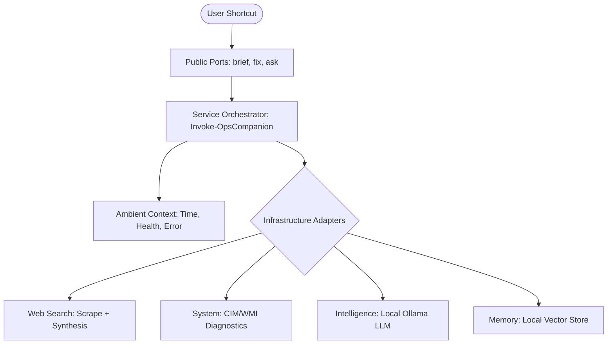

<div align="center">

# PowershellOps

**Advanced Operational Intelligence & Universal AI Companion for Windows.**  
*Private. High-Performance. Local Agentic Stack.*

[](#)
[-8A2BE2?logo=ollama&logoColor=white)](#)
[](#)
[](#)

---

**81 Utility Tools · 7 Operational Workflows · Universal AI Hub · Zero Cloud Dependencies**  
*Muted, professional precision for the modern Technical Specialist.*

[Features](#-key-capabilities) • [Installation](#-provisioning) • [The Hub](#-universal-ai-companion) • [Memory](#-semantic-recall) • [Security](#-security-audit)

</div>

---

## ── PHILOSOPHY ────────────────────────────────────────────────────────────

PowershellOps is a professional **Agentic Stack** for Windows, designed for specialists who demand privacy, execution speed, and deep system insights. It transforms the terminal from a command shell into an **Intelligent Companion Hub** that reasons over local context and researches online information entirely within your perimeter.

- **AGENTIC WORKFLOWS**: Multi-step AI reasoning for system repair and data analysis.
- **SITUATIONAL AWARENESS**: Automatic injection of time, date, and system load into every AI query.
- **SECURITY SUBSTRATE**: Local auditing of firewalls, listeners, and persistence vectors.
- **PORTABLE & CLEAN**: A minimalist "Thin Core" architecture with zero meta-bloat.

---

## ── PROVISIONING ──────────────────────────────────────────────────────────

Deploy the core operational environment directly from **PowerShell 7**:

```powershell
irm https://raw.githubusercontent.com/shahriarhaqueabir/PowershellOps/main/install.ps1 | iex
```

*Requirements: PowerShell 7.2+, Git, and Ollama (optional for AI features).*

---

## ── THE COMPANION HUB (`hub`) ──────────────────────────────────────────────

The central "Brain" of your terminal. A single entry point for high-speed operational tasks.

| Shortcut | Command | Action |
|:---|:---|:---|
| **`brief`** | `Get-OpsDailyBrief` | **Daily Executive Report**: News + Health + Security. |
| **`fix`**   | `Invoke-OpsShortFix`| **Self-Healing**: AI-driven remediation of the last error. |
| **`stat`**  | `Invoke-OpsShortStat`| **Instant Pulse**: 1-page health/resource snapshot. |
| **`ask`**   | `Invoke-OpsShortAsk` | **Pipable Research**: Analyze pipeline data with local LLMs. |
| **`mem`**   | `Invoke-OpsShortMem` | **Vector Storage**: Save personal operational notes/preferences. |

---

## ── QUICK REFERENCE ──────────────────────────────────────────────────────

### 🖥️ SYSTEM DIAGNOSTICS (`stat`)
| Alias | Description | Technical Metric |
|:---|:---|:---|
| `corehealth`| Real-time system health | CPU, RAM, Procs, Handles |
| `sysspec`   | Hardware specifications | Processor, Cores, GPU |
| `sysuptime` | System availability | Continuous run-time tracking |
| `diskpressure`| Storage capacity audit | Free space % and volume state |

### 🛡️ SECURITY AUDIT (`scan`)
| Alias | Description | Audit Focus |
|:---|:---|:---|
| `adminaudit`| Administrator group audit | Access control & membership |
| `shieldstatus`| Windows Defender state | Endpoint protection health |
| `fwcheck`   | Firewall & port cross-ref | Rule gap detection |
| `threathunt`| Heuristic anomaly triage | Suspicious files & ports |

### 🌐 NETWORK TRIAGE
| Alias | Description | Connectivity Info |
|:---|:---|:---|
| `netping`   | Internet reachability | ICMP latency & state |
| `wificheck` | WLAN diagnostics | SSID, Signal intensity |
| `dnsbench`  | Multi-resolver benchmark | Resolution performance |

---

## ── ARCHITECTURE ──────────────────────────────────────────────────────────

PowershellOps utilizes a **Hexagonal (Ports & Adapters)** design to ensure maximum portability and low-latency execution.


```mermaid
graph TD
    User([User Shortcut]) --> Ports[Public Ports: brief, fix, ask]
    Ports --> Service[Service Orchestrator: Invoke-OpsCompanion]
    Service --> Context[Ambient Context: Time, Health, Error]
    Service --> Adapters{Infrastructure Adapters}
    Adapters --> Web[Web Search: Scrape + Synthesis]
    Adapters --> CIM[System: CIM/WMI Diagnostics]
    Adapters --> AI[Intelligence: Local Ollama LLM]
    Adapters --> Memory[Memory: Local Vector Store]
```

---

## ── DATA INTEGRITY ────────────────────────────────────────────────────────

- **100% Private**: No data ever leaves your machine. No telemetry, no cloud logging.
- **Local Reasoning**: LLM operations are performed via local Ollama instances.
- **Privacy Filters**: Integrated `secretmask` technology automatically redacts sensitive tokens before processing.

---

<div align="center">
  <sub>Developed for Professionals by <a href="https://github.com/shahriarhaqueabir">Shahriar Haque Abir</a></sub>
</div>
